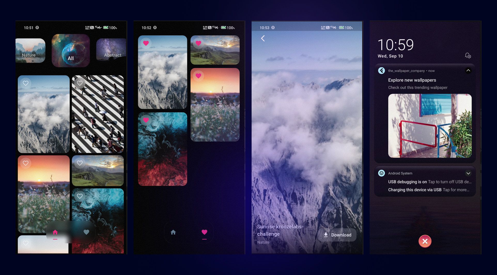

# The Wallpaper Company

A production-ready Flutter wallpaper app for the Kroozelabs Intern Challenge.

## Screenshots



---

## Setup & Installation

1. **Clone the repository:**
   ```bash
   git clone <your-repo-url>
   cd the_wallpaper_company
   ```
2. **Install dependencies:**
   ```bash
   flutter pub get
   ```
3. **Run the app:**
   ```bash
   flutter run
   ```

## Firebase Setup

1. Install the FlutterFire CLI:
   ```bash
   dart pub global activate flutterfire_cli
   ```
2. Login to Firebase:
   ```bash
   flutterfire login
   ```
3. Initialize Firebase in your project:
   ```bash
   flutterfire configure
   ```
   - Select your Firebase project and platforms (Android/iOS).
   - This will generate `lib/firebase_options.dart` automatically.
4. Add `google-services.json` (Android) to `android/app/`.
5. Add `GoogleService-Info.plist` (iOS) to `ios/Runner/`.
6. Enable **Cloud Messaging** and **Remote Config** in the Firebase Console.

For more details, see the [FlutterFire CLI documentation](https://firebase.flutter.dev/docs/cli/).

## Remote Config Keys Used

- `dark_mode_enabled` (bool): Toggles dark mode in the app.
  - Example usage: `remoteConfig.getBool('dark_mode_enabled')`

## JSON Endpoint Usage

Wallpapers are fetched from:
```
https://jsonkeeper.com/b/ORGZR
```
- The endpoint returns a list of wallpaper objects in JSON format.
- Each wallpaper object contains: `id`, `title`, `imageUrl`, `category`.


## Features
- Home screen with category carousel
- Staggered grid and shimmer loading(Printerest Style)
- Fullscreen preview and favorites
- Pull-to-refresh and double-tap to like animation
- Firebase Remote Config for dark mode
- Firebase Cloud Messaging for notifications
- Provider for state management
- Persistent image cache 
- Modern UI

## Suggested Feature Updates for Open Source Contributions

Here are some suggested feature updates for contributors to work on:

### Beginner-Friendly Tasks
- **Bug Fixes:**
  - Identify and fix small UI bugs or alignment issues.
  - Resolve any redundant code or formatting inconsistencies.

### New Features
- **Dark Mode Toggle:**
  - Add a toggle button to enable/disable dark mode.
- **Search Wallpapers:**
  - Implement a search bar to find wallpapers by title or category.
- **Share Wallpaper:**
  - Add functionality to share wallpapers via social media or messaging apps.

### UI/UX Improvements
- **Onboarding Screens:**
  - Create an onboarding flow for first-time users.
- **Animations:**
  - Add smooth transitions and animations for better user experience.

### Localization
- **Multi-Language Support:**
  - Add support for at least two additional languages.

### Testing
- **Unit Tests:**
  - Write unit tests for existing features.
- **Integration Tests:**
  - Ensure the app works seamlessly across different platforms.

### Documentation
- **Update README:**
  - Add detailed setup instructions for contributors.
- **Code Comments:**
  - Add comments to explain complex logic in the codebase.

### Open Issues
- Create GitHub issues for the above tasks with labels like `good first issue` and `help wanted` to guide contributors.

---

## License
MIT
